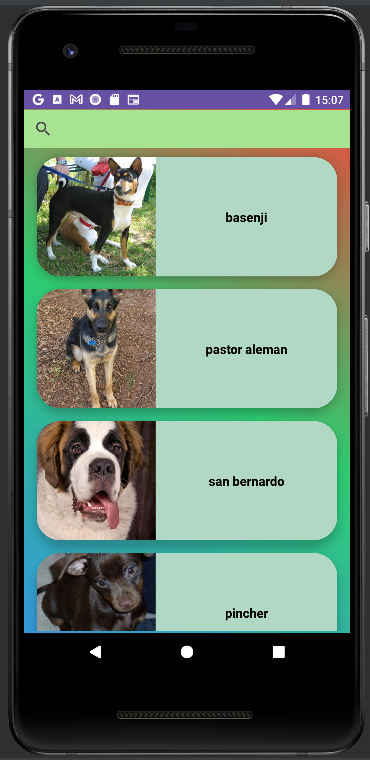
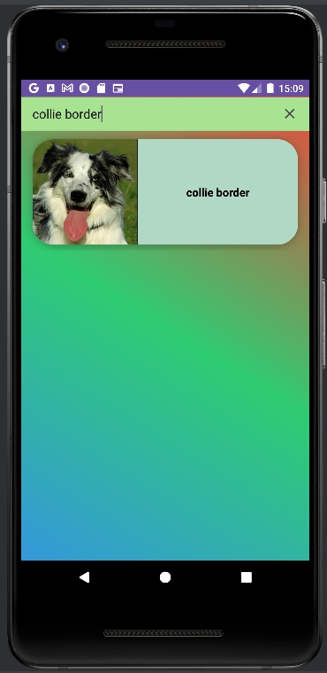
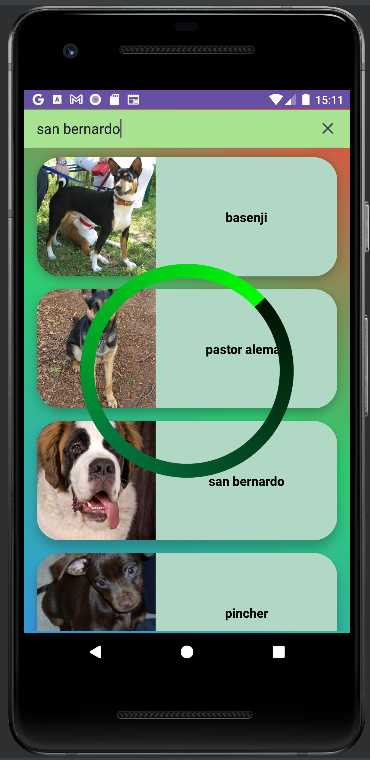
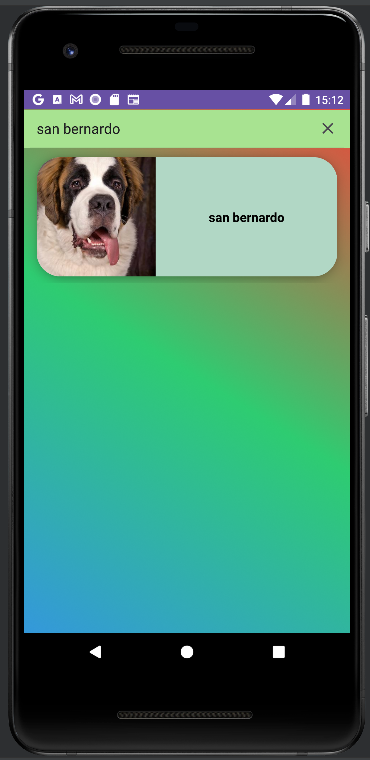
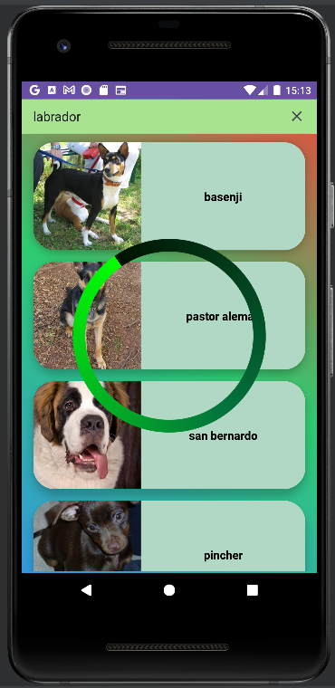
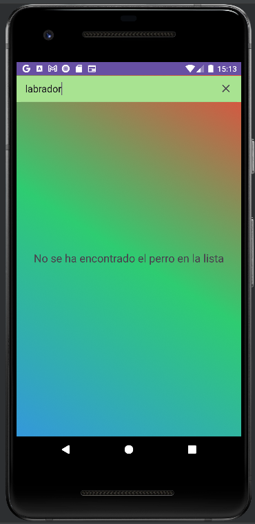

# Proyecto Dog

## Descripción
Este proyecto se centra en la obtención y visualización de información sobre perros. Utiliza una arquitectura MVVM con Dagger Hilt para la inyección de dependencias.

## Estructura del Proyecto
- **aplicacion**
  - `DogApiAplicacion`: Clase de aplicación principal que inicializa Dagger Hilt.
    ```kotlin
      @HiltAndroidApp
      class DogApiAplicacion : Application()
    ```
- **data.source**
  - `Dogs`: Objeto Dogs es la fuente de datos simulada para la aplicación.
   ```kotlin
     object Dogs {
          val dogs : List<Pair<String, String>> = listOf(
              Pair( "basenji", "https://images.dog.ceo/breeds/basenji/n02110806_5744.jpg" ),
               resto codigo......
         )
      }
   ``` 
- **data.models**
  - `Dog`: Clase de datos que representa un perro.
   ```kotlin
     data class Dog(
        val name: String,
        val image: String
     )
     {
          override fun toString(): String {
              return "Dog(name='$name', image='$image')"
         }
     }
   ```
  - `DogRepositoryInterfaceDao`: Interfaz que define métodos para obtener datos sobre perros.
      ```kotlin
        class DogRepositoryDao @Inject constructor(
            private val service: DogService
          ) : DogRepositoryInterfaceDao {
              resto codigo.......
        }
     ``` 
  - `Repository`: Objeto que almacena la lista de perros en memoria.
     ```kotlin
       class Repository {
          companion object {
              var dogs:List<Dog> = emptyList()
          }
      }
     ```
- **data.service**
  - `DogServiceInterface`: Interfaz que define métodos para obtener datos sobre perros desde una fuente de datos externa.
       ```kotlin
         interface DogServiceInterface {
              fun getDogs(): List<Pair<String,String>>
              fun getBreedDogs (breed: String) : List<Pair<String,String>>
         }
     ```
  - `DogService`: Implementación de la interfaz `DogServiceInterface`, accediendo a datos simulados en `Dogs.dogs`.
    ```kotlin
       class DogService @Inject constructor(): DogServiceInterface {
            //Método que accede a la BBDD y devuelve todos los datos
            override fun getDogs(): List<Pair<String, String>> {
                return Dogs.dogs
            }
            override fun getBreedDogs(breed: String): List<Pair<String, String>> {
                val newDogs = Dogs.dogs.filter {
                    it.first == breed
                }
                return newDogs
            }
      }
    ```

- **domain.userCase**
  - `GetDogsUseCase`: Caso de uso para obtener la lista completa de perros.
      ```kotlin
        class GetDogsUseCase @Inject constructor(
            private  val dogRepositoryDao: DogRepositoryDao) {
          operator fun invoke(): List<Dog>?{
            return  dogRepositoryDao.getDogs()
          }
        }
      ```
  - `GetDogsBreedUseCase`: Caso de uso para obtener la lista de perros de una raza específica.
      ```kotlin
         class GetDogsBreedUseCase @Inject constructor(
              private val dogRepositoryDao: DogRepositoryDao
            ){
            private var breed: String = ""
            fun setBreed(breed: String){
                this.breed = breed
            }
            operator fun invoke() : List<Dog>{
              return  dogRepositoryDao.getBreedDogs(breed)
            }
        }
      ```
- **ui.adapter**
  - `DogAdapter`: Adaptador para el RecyclerView que muestra la lista de perros.
     ```kotlin
       class DogAdapter: RecyclerView.Adapter<ViewHDog>(){
           var dogRepository: List<Dog> = Repository. dogs //cargo del repsitorio dememoria.
  
           override fun onCreateViewHolder(parent: ViewGroup, viewType: Int): ViewHDog {
              val layoutInflater = LayoutInflater.from(parent. context)//objeto para crear la vista.
              val layoutItemRestaurant = R.layout.item_dogs //accedo al xml del item a crear.
              return ViewHDog(
                  layoutInflater.inflate(layoutItemRestaurant, parent, false)
              )
           }
          override fun onBindViewHolder(holder: ViewHDog, position: Int) {
              holder.renderize(dogRepository[position]) //renderizamos la view.
          }
          override fun getItemCount(): Int = dogRepository.size
      }
      ```
  - `ViewHDog`: ViewHolder para representar la vista de un elemento de perro en el RecyclerView.
      ```kotlin
       class ViewHDog (view: View): RecyclerView.ViewHolder (view) {
            private lateinit var binding: ItemDogsBinding
            init {
                binding = ItemDogsBinding.bind(view)
            }
            //método que se encarga de mapear los item por propiedad del modelo.
            fun renderize(dog : Dog){
                binding.txtviewName.setText(dog. name)
                Glide
                    .with( itemView.context)
                    .load(dog.image)
                    .centerCrop()
                    .into( binding.ivDogs)
            }
      }
      ```

- **ui.modelView**
  - `DogViewModel`: ViewModel que gestiona la lógica de presentación y maneja la comunicación entre la interfaz de usuario y el repositorio.
     ```kotlin
       @HiltViewModel
       class DogViewModel @Inject constructor(
              private val useCaseList : GetDogsUseCase,
              private val getDogsBreedUseCaseProvider: Provider<GetDogsBreedUseCase>
          )  : ViewModel() {
          var dogListLiveData = MutableLiveData<List<Dog>>() //repositorio observable.
          var progressBarLiveData = MutableLiveData<Boolean> () //progressbar observable
          var search = MutableLiveData<String>() //para el campo search observable
          val text = MutableLiveData<String>()
     
          fun searchByBreed(breed: String){
              search.value = breed //se notifican los cambios
          }
          fun list() {
             resto codigo....
          }
          fun listForBreed(breed: String) {
              resto codigo......
          }
       }
      ```

- **ui.views**
  - `MainActivity`: Actividad principal que muestra la lista de perros y permite la búsqueda por raza.
     ```kotlin
       @AndroidEntryPoint
       class MainActivity : AppCompatActivity(), SearchView.OnQueryTextListener{
            lateinit var binding: ActivityMainBinding
            lateinit var adapter: DogAdapter
            val dogViewModel: DogViewModel by viewModels() //tiene que ser constante.
            resto codigo ....
                binding.mySearch.setOnQueryTextListener( this) //cargamos el listener, para el EditText
                initRecyclerView() //inicializamos el recyclerView. 
                adapter = DogAdapter() // Inicializa el adaptador con una lista vacía.
                registerLiveData() //Suscribimos nuestro Activity a recibir notificaciones del ViewModel.
                loadDada()
            }
            private fun initRecyclerView(){
                binding.myRecyclerView.layoutManager = LinearLayoutManager( this)
            }
            private fun loadDada() {
                dogViewModel.list() //simulamos un evento para iniciar la carga de datos desde el viewmodel
            }
            private fun registerLiveData() {
                dogViewModel.dogListLiveData.observe(this){ myList ->
                   resto codigo......
                }
                dogViewModel.progressBarLiveData.observe(this) { visible ->
                   resto codigo...
                }
                dogViewModel.search.observe(this) { bread ->
                   resto codigo...
                }

                dogViewModel.text.observe(this){it ->
                    binding.textDog.text = it
                }
            }

            override fun onQueryTextSubmit(query: String?): Boolean {
                if (!query. isNullOrEmpty())
                    dogViewModel.searchByBreed(query!!)
                return true
            }
            
            override fun onQueryTextChange(newText: String?): Boolean {
                if (newText. isNullOrEmpty()) {
                    dogViewModel.list()
                    hideKeyBoard() //esconde el teclado.
                }
                return true
            }
        
            private fun hideKeyBoard() {
                val imn = getSystemService( INPUT_METHOD_SERVICE) as InputMethodManager
                imn.hideSoftInputFromWindow( binding.myRecyclerView .windowToken, 0)
            }

        }
      ```

## Uso
Para utilizar este proyecto, sigue los siguientes pasos:

1. Asegúrate de tener todas las dependencias instaladas.
2. Ejecuta la aplicación en un emulador o dispositivo físico.
3. Observa la lista de perros y realiza búsquedas por raza.

## Dependencias
A continuación, se enumeran y explican las dependencias clave utilizadas en el proyecto:

- **Dagger Hilt**: Biblioteca para la inyección de dependencias en Android.
  - `implementation "com.google.dagger:hilt-android:2.44"`: Agrega las bibliotecas necesarias para Dagger Hilt.
  - `kapt "com.google.dagger:hilt-android-compiler:2.44"`: Proporciona el procesador de anotaciones necesario para Dagger Hilt.

- **ViewModel & LiveData**: Componentes de Android Architecture Components para la creación de modelos de vista.
  - `implementation "androidx.lifecycle:lifecycle-viewmodel-ktx:2.7.0"`: Contiene clases y extensiones para trabajar con ViewModels.
  - `implementation "androidx.lifecycle:lifecycle-livedata-ktx:2.7.0"`: Proporciona LiveData para la comunicación entre componentes.

- **Glide**: Biblioteca para cargar y mostrar imágenes de manera eficiente.
  - `implementation "com.github.bumptech.glide:glide:4.14.2"`: Agrega la biblioteca Glide para la carga de imágenes.


## Notas Adicionales
- La carga de datos se realiza mediante `DogService`, que simula acceder a una base de datos de perros.
- El paquete `domain.userCase` contiene casos de uso que interactúan con el repositorio para obtener y procesar datos.
- La interfaz de usuario está implementada en `MainActivity`, utilizando un RecyclerView y un SearchView.
- La clase de aplicación principal `DogApiAplicacion` utiliza Dagger Hilt para la inyección de dependencias.

## Imagenes de ejecución













[REPOSITORIOhttps://github.com/johnlopez0505/proyectoDog/tree/dev](https://github.com/johnlopez0505/proyectoDog/tree/dev)


